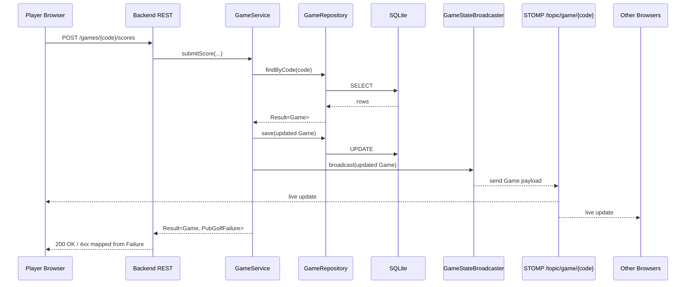
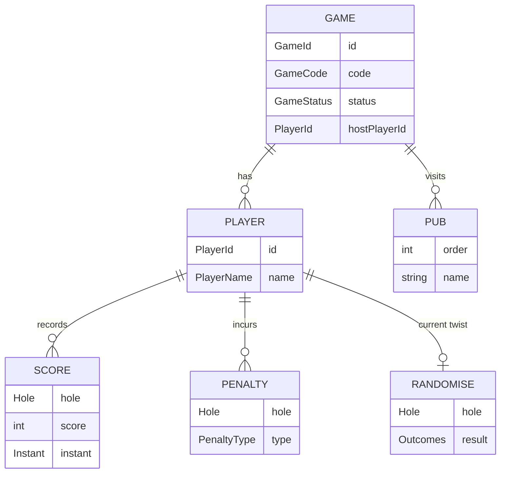

# Architecture

> System design, components, and data flow for Pub Golf.

## Overview

Pub Golf is a small monorepo: a Kotlin/Spring Boot backend exposes a REST API plus a STOMP
WebSocket topic for live game state, and a Next.js (App Router) frontend renders the host,
player, and leaderboard views. SQLite is the system of record locally, accessed via JPA with
Flyway migrations. The dominant patterns are Result4k for error handling on the backend and
contract-tested Fakes for fast, isolated testing.

## Diagram

```mermaid
flowchart LR
    Browser[Browser<br/>Next.js App Router]
    Backend[Backend<br/>Spring Boot]
    DB[(SQLite<br/>JPA + Flyway)]
    WS[STOMP / WebSocket]

    Browser -->|REST: create / join / score| Backend
    Browser <-->|subscribe /topic/game/{code}| WS
    Backend --- WS
    Backend --> DB
```

## Components

| Component | Responsibility | Location |
|-----------|----------------|----------|
| REST controllers | HTTP endpoints for game lifecycle, scoring, randomise, pubs | `apps/backend/src/main/kotlin/uk/co/suskins/pubgolf/controller` |
| Services | Business logic, returns `Result<T, PubGolfFailure>` | `apps/backend/src/main/kotlin/uk/co/suskins/pubgolf/service` |
| Repositories | Data access interfaces + JPA adapters | `apps/backend/src/main/kotlin/uk/co/suskins/pubgolf/repository` |
| Domain models | `Game`, `Player`, `Score`, `Pub`, etc. | `apps/backend/src/main/kotlin/uk/co/suskins/pubgolf/models/Domain.kt` |
| Game state broadcaster | Pushes updated `Game` over STOMP after writes | `apps/backend/src/main/kotlin/uk/co/suskins/pubgolf` |
| WebSocket config | STOMP endpoint, broker, CORS | `apps/backend/src/main/kotlin/uk/co/suskins/pubgolf/config` |
| Test fixtures (Fakes) | In-memory `Fake` implementations of repositories + broadcaster | `apps/backend/src/testFixtures/kotlin` |
| App Router pages | Home, `game/[code]`, `submit-score`, `randomise` | `apps/frontend/app` |
| `useGameWebSocket` hook | Subscribes to `/topic/game/{code}` and exposes live state | `apps/frontend/hooks` |
| API client | REST calls to the backend | `apps/frontend/lib/api.ts` |
| E2E tests | Playwright drives the full stack | `e2e/` |

## Request Flow

A player submits a score for a hole and every connected client sees the new leaderboard.



## Key Decisions

- **Result4k over exceptions.** Service and repository functions return
  `Result<T, PubGolfFailure>`. Failures are values, not control flow, and controllers map
  them to HTTP responses in one place. Keeps the happy path readable and the failure modes
  explicit.
- **Contract tests with Fakes.** Each repository (and the broadcaster) defines a `Contract`
  test interface. Both the JPA-backed implementation and the in-memory `Fake` implement the
  same contract test, so the Fake stays honest. Unit and scenario tests then use the Fake
  for speed; integration tests use the real implementation.
- **STOMP over WebSocket for live updates.** Clients subscribe to `/topic/game/{code}` and
  the backend pushes the full updated `Game` after any mutating action. Simpler than diff
  protocols and good enough for the game's size.
- **SQLite + Flyway.** Single-file database is enough for the workload; Flyway gives us
  migrations on top. Hibernate Community Dialects provides SQLite support for JPA.
- **Monorepo with Make as the interface.** Backend (Gradle), frontend (Bun), and e2e (Bun +
  Playwright) each have native tooling, but `make` is the canonical entry point so every
  contributor and CI step runs the same commands.

## Data Model



`Game` is the aggregate root: it owns its `Player`s, the `Pub` route, and the active twist.
Scores are a `Map<Hole, ScoreWithTimestamp>` per player, initialised to zero for every hole
up to `GameConstants.MAX_HOLES`.

## External Dependencies

| Service | Purpose | Failure mode |
|---------|---------|--------------|
| Browser WebSocket | Live leaderboard via STOMP | Frontend falls back to REST `GET /games/{code}` on reconnect |
| Routing/geometry data | Pub route polyline rendering | Game still playable; map view degrades |
